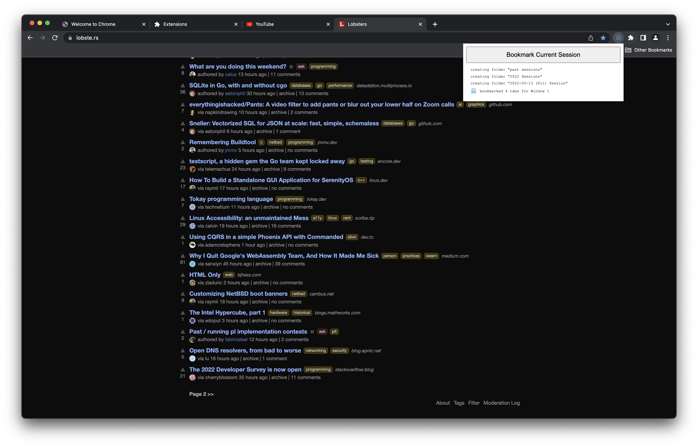
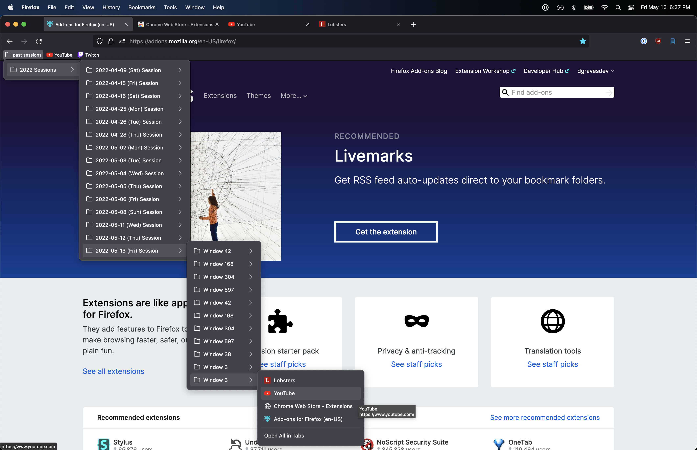

bookmark-session-extension
==================================

Gives you a single button to save all opened tabs into your bookmarks in an organized way, so you can close your browser with peace of mind.


Bookmark Session will maintain a bookmark folder named `past sessions`, and once the `Bookmark Current Session` button is clicked, bookmark directories will be created by year/day/window, and all the associated open tabs will have bookmarks saved for them.

The intended usage is for the user to:

* realize they have way too many tabs open
* click the button to save all opened tabs to their bookmarks
* close all the tabs to start a fresh browser session.

This addon will prevent you from losing any important tabs you meant to keep open.


# Screenshots

_Clicking the `Bookmark Current Session` button to save bookmarks_


_Opening the `past sessions` bookmark folder tree_



# Structure of the `past sessions` folder

Here's the structure of how the <b>`past sessions`</b> directory is arranged:

```
    past sessions/
    ├── 2020 Sessions/
    │   ├── 2020-03-10 (Tue) Session/
    │   │   ├── Window 1/
    │   │   │   └── Website 1 Bookmark
    │   │   └── Window 2/
    │   │       ├── Website 2 Bookmark
    │   │       └── Website 3 Bookmark
    │   ├── 2020-08-13 (Thu) Session/
    │   │   ├── Window 1/
    │   │   │   ├── Website 4 Bookmark
    │   │   │   └── Website 5 Bookmark
    │   │   └── Window 2/
    │   │       └── Website 6 Bookmark
    │   └── 2020-12-15 (Tue) Session/
    │   │   ├── Window 1/
    │   │   │   └── Website 7 Bookmark
    │   │   └── Window 2/
    │   │       └── Website 8 Bookmark
    ├── 2021 Sessions/
    │   ├── 2021-01-03 (Sun) Session/
    │   │   └── . . .
    │   └── . . .
    └── . . .
```
